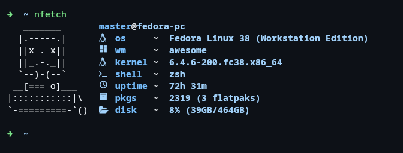

# ⚡ nFetch



⚡ nFetch is a dependency-free, fast system information fetching tool aiming for maximum customizability on peek performance

### 🎨 Customization

#### Ascii-art
The ascii-art must be set in `~/.config/nfetch/art.txt`

A rich config implementation will be coming soon!

### 💭 Why?
I wanted a system fetching tool for the look. Sadly, the ones i saw where not what i wanted and neofetch is too slow for my liking. This is where go and boredom came into place.

### 💪 Goal
My goal was to not use any dependencies. I wanted to achieve maximum performance while fetching accurate informations. My next goal is to implememt a config system, add more available informations and publish it to some package repositories to make installation easier.

### Todo

#### General
- Image support
- Config file
- Nerdicons

#### Missing infos (coming soon)
- WM
- GPU
- COLORS
- PACKAGES
- SHELL
- RESOLUTION
- THEME
- ICONS
- TERMINAL FONT
- TERMINAL
- DISK

### 💙 Like it?
If you like this project and want to support me, please leave me a ⭐ on this repo. I would really appreciate it ❤️

### 👥 Contribution
If you have a feature suggestion, improvement or fix, feel free to open an issue or pr for it.

### ⚙️ Build
Git clone:
```sh
# Clone the repo
git clone https://github.com/NeuroException/nfetch

# Navigate into it
cd nfetch

# Build the project
go build main.go

# Rename the outcome
mv main nfetch

# Install it system-wide
sudo mv nfetch /usr/bin
```
